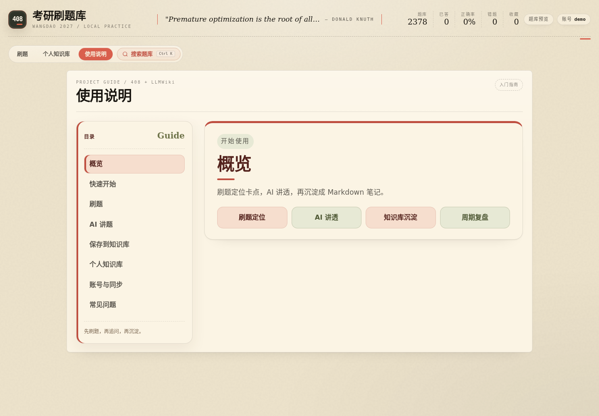
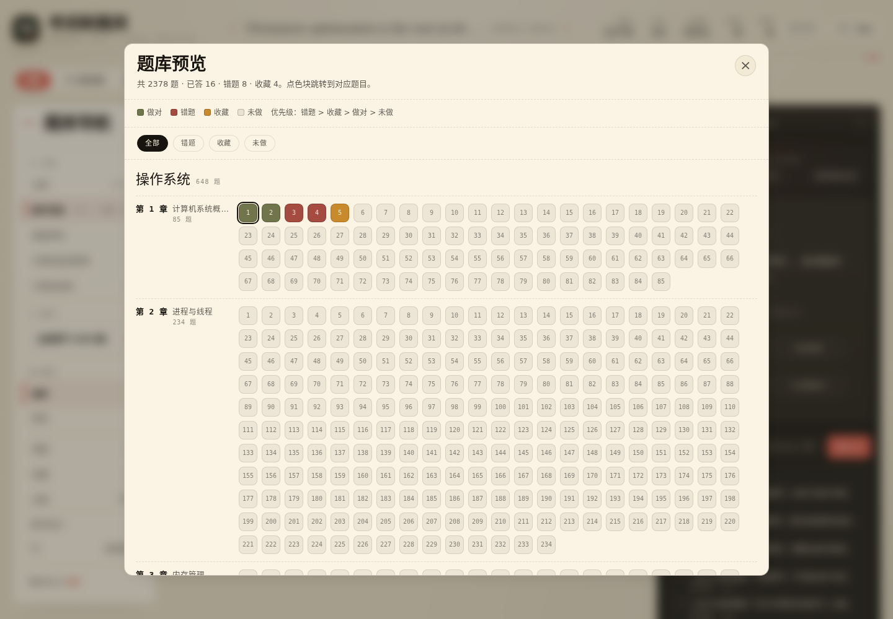
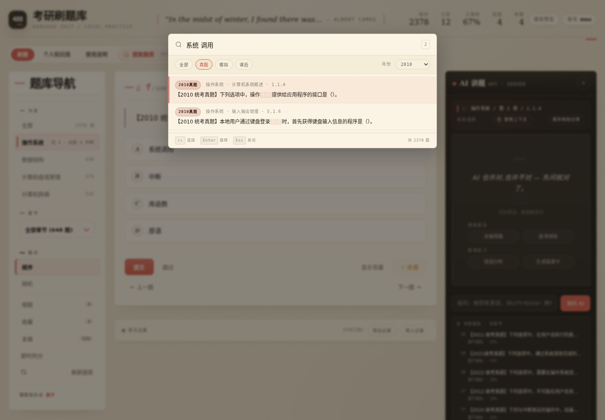
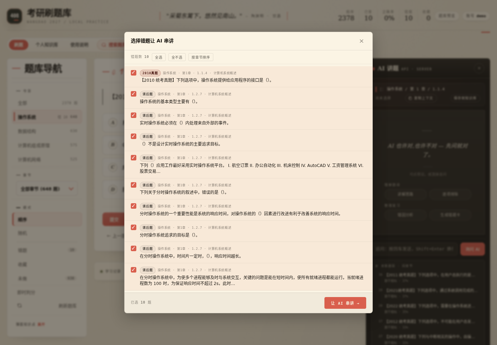
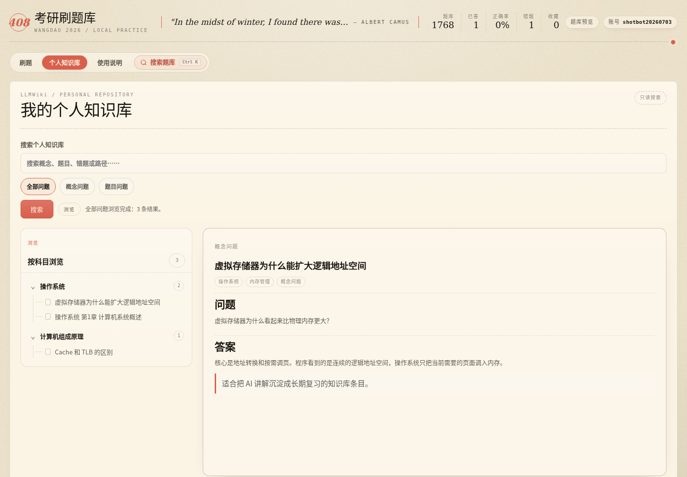

# 408 考研刷题库

一个面向 408 考研复习的网页刷题应用：题库、错题、收藏、AI 讲题和个人知识库放在同一个界面里。仓库本身是静态 Web 应用，克隆后不需要构建即可运行；账号同步、后端 AI 代理和个人知识库属于可选增强能力。

> 适合：408 复习刷题、错题复盘、AI 讲题、把题目/概念追问沉淀为自己的知识库。

## 在线体验

| 页面 | 地址 |
|---|---|
| 刷题 | `https://quiz.hermesjj.com/#/quiz` |
| 个人知识库 | `https://quiz.hermesjj.com/#/wiki` |
| 使用说明 | `https://quiz.hermesjj.com/#/guide` |

如果页面没有更新，先尝试强制刷新：`Ctrl + F5`。

---

## 功能概览

- 四门 408 科目题库：操作系统、数据结构、计算机组成原理、计算机网络。
- 题库规模：`data.json` 当前包含 `1777` 道题，运行时不需要联网下载题库。
- 多种刷题模式：顺序、随机、错题、收藏、未做、全部随机。
- 本地学习记录：错题、收藏、已答统计、偏好设置默认保存在浏览器 `localStorage`。
- 可选账号同步：接入后端后可把进度绑定到账号。
- AI 讲题：自动整理当前题目上下文，可复制给外部 AI，也可配置 API 后直接追问。
- 个人知识库：支持保存 AI 讲解和追问结果，浏览、搜索、预览、编辑、软删除。
- 智能分类：首次追问决定保存为“概念问题”或“题目问题”；同题后续追问保持独立状态。
- Markdown/公式/代码渲染：题面、解析和 AI 输出支持 Markdown、KaTeX 和代码块。
- 导入导出：学习记录可用 JSON 迁移。


---

## 快速开始

### 方式一：直接用 Python 静态服务

```bash
git clone https://github.com/lij768423-svg/408-.git
cd 408-
python3 -m http.server 8767
```

打开：

```text
http://127.0.0.1:8767/
```

### 方式二：用 Node 静态服务

```bash
git clone https://github.com/lij768423-svg/408-.git
cd 408-
npx serve . -l 8767
```

打开：

```text
http://127.0.0.1:8767/
```

### 方式三：只打开文件

也可以直接双击 `index.html`，但不推荐长期这样用：

- `file://` 和 `http://127.0.0.1:8767` 是不同浏览器来源。
- 两种打开方式的 `localStorage` 不互通。
- 某些浏览器对本地文件的资源读取限制更严格。

---

## 部署指南

本项目最简单的部署方式是当作静态网站托管。由于应用使用 hash 路由（`#/quiz`、`#/wiki`、`#/guide`），大多数静态托管平台无需额外 SPA fallback 配置。

### 部署形态对比

| 形态 | 适合场景 | 可用能力 |
|---|---|---|
| GitHub Pages / 静态托管 | 公开演示、个人使用 | 刷题、本地错题/收藏、导入导出、复制 AI 上下文 |
| Nginx/Caddy 静态站点 | 自己服务器长期运行 | 同上，可绑定域名和 HTTPS |
| Docker 静态站点 | 服务器上容器化运行 | 同上，方便 systemd/Docker 自启动 |
| 静态前端 + `/api/*` 后端 | 多用户服务 | 账号、进度同步、后端 AI 代理、个人知识库 |

### 1. GitHub Pages

1. Fork 或推送本仓库到自己的 GitHub 仓库。
2. 进入仓库 `Settings -> Pages`。
3. Source 选择 `Deploy from a branch`。
4. Branch 选择 `main`，目录选择 `/root`。
5. 保存后等待 GitHub Pages 构建完成。

访问地址通常是：

```text
https://<你的用户名>.github.io/<仓库名>/
```

例如仓库名为 `408-` 时，路径可能是：

```text
https://<你的用户名>.github.io/408-/
```

> GitHub Pages 纯静态部署没有 `/api/*` 后端。账号同步、服务端 AI 代理和个人知识库接口不可用；本地刷题记录仍可保存在当前浏览器。

### 2. Nginx 静态部署

把仓库放到服务器目录，例如：

```bash
sudo mkdir -p /var/www/408-quiz
sudo rsync -a --delete ./ /var/www/408-quiz/
```

Nginx 配置示例：

```nginx
server {
    listen 80;
    server_name quiz.example.com;

    root /var/www/408-quiz;
    index index.html;

    location / {
        try_files $uri $uri/ /index.html;
    }

    location ~* \.(?:css|js|json|svg|jpg|jpeg|png|webp|woff2?)$ {
        expires 7d;
        add_header Cache-Control "public";
        try_files $uri =404;
    }
}
```

验证并重载：

```bash
sudo nginx -t
sudo systemctl reload nginx
curl -I http://quiz.example.com/
```

如果你只用 hash 路由，`try_files $uri $uri/ /index.html;` 不是强制要求，但保留它更稳。

### 3. Caddy 静态部署

`Caddyfile` 示例：

```caddyfile
quiz.example.com {
    root * /var/www/408-quiz
    file_server
    try_files {path} /index.html
}
```

启动或重载：

```bash
sudo systemctl reload caddy
```

### 4. Docker 静态部署

不需要在仓库里写 Dockerfile，也可以直接用 Nginx 镜像挂载当前目录：

```bash
docker run -d \
  --name 408-quiz \
  --restart unless-stopped \
  -p 8767:80 \
  -v "$PWD:/usr/share/nginx/html:ro" \
  nginx:1.27-alpine
```

访问：

```text
http://127.0.0.1:8767/
```

更新代码后：

```bash
git pull
docker restart 408-quiz
```

### 5. Docker Compose 静态部署

`docker-compose.yml` 示例：

```yaml
services:
  quiz:
    image: nginx:1.27-alpine
    container_name: 408-quiz
    restart: unless-stopped
    ports:
      - "8767:80"
    volumes:
      - ./:/usr/share/nginx/html:ro
```

启动：

```bash
docker compose up -d
curl -I http://127.0.0.1:8767/
```

---

## 可选：部署完整多用户后端

仓库当前开箱即用的是静态前端。若要启用账号同步、后端 AI 代理和个人知识库，需要额外提供兼容的 `/api/*` 服务。

### 前端期望的 API

| 方法 | 路径 | 说明 |
|---|---|---|
| `GET` | `/api/auth/me` | 查询当前登录用户 |
| `POST` | `/api/auth/register` | 注册并写入会话 Cookie |
| `POST` | `/api/auth/login` | 登录并写入会话 Cookie |
| `POST` | `/api/auth/logout` | 登出并清理会话 Cookie |
| `GET` | `/api/progress` | 读取账号级刷题进度 |
| `PUT` | `/api/progress` | 保存账号级刷题进度 |
| `GET` | `/api/ai/status` | 查询后端 AI 代理状态 |
| `POST` | `/api/ai/chat` | 后端 AI 聊天代理，可支持流式返回 |
| `POST` | `/api/wiki/save-question` | 保存题目/概念到个人知识库 |
| `GET/POST` | `/api/wiki/search` | 搜索个人知识库 |
| `GET/POST` | `/api/wiki/note` | 读取单篇笔记 |
| `POST` | `/api/wiki/note/update` | 更新笔记正文 |
| `POST` | `/api/wiki/note/delete` | 软删除笔记 |

### 推荐后端职责

一个完整后端通常需要：

- 静态文件服务：返回 `index.html`、`assets/*`、`data.json`、`images/*`。
- 账号系统：注册、登录、退出、会话 Cookie。
- 进度存储：按用户保存错题、收藏、统计、偏好设置。
- AI 代理：把用户请求转发到 OpenAI/Anthropic/Ollama 等兼容接口。
- 知识库服务：按用户隔离保存 Markdown，提供搜索、读取、编辑和软删除。
- 安全控制：限制请求体大小、校验路径、保护密钥、避免把 `.env` 暴露到静态目录。

### 后端部署建议

- 密钥只放在服务器 `.env` 或 Secret Manager，不写入仓库。
- Cookie 建议设置 `HttpOnly`、`SameSite=Lax`，HTTPS 下增加 `Secure`。
- `/api/wiki/note/update` 和 `/api/wiki/note/delete` 必须做用户隔离和路径穿越校验。
- 知识库保存建议支持 `Idempotency-Key`，避免用户重复点击导致重复写入。
- 数据库、用户知识库和上传/生成数据应放在持久化目录，并加入备份策略。

### 反向代理 `/api/*`

如果静态文件由 Nginx 托管，后端监听在 `127.0.0.1:8787`，可按需增加：

```nginx
location /api/ {
    proxy_pass http://127.0.0.1:8787/;
    proxy_set_header Host $host;
    proxy_set_header X-Real-IP $remote_addr;
    proxy_set_header X-Forwarded-For $proxy_add_x_forwarded_for;
    proxy_set_header X-Forwarded-Proto $scheme;
}
```

> 注意：上面的 `proxy_pass` 只是示例。实际后端如果已经包含 `/api/...` 路径，末尾斜杠和路径重写规则要相应调整。

---

## 使用说明

### 路由

| 路由 | 说明 |
|---|---|
| `#/quiz` | 默认刷题页：题卡、模式、进度、AI 讲题 |
| `#/wiki` | 个人知识库：目录树、搜索、预览、编辑、软删除 |
| `#/guide` | 使用说明：保存规则、概念/题目分类、常见操作路径 |



### 刷题流程

五分钟上手路径：

1. 登录账号，进入 `#/quiz`。
2. 在左侧选择科目、章节和刷题模式。
3. 点击 A/B/C/D 选择答案，多选题可连续选择多个选项。
4. 点击“提交”判分，查看正确答案、你的答案和题库解析。
5. 看不懂时在右侧 AI 面板追问，讲清楚后点击“保存到知识库”。
6. 一章刷完后，用错题模式、收藏模式或批量串讲做集中复盘。

即时判分开启后：

- 单选题：点击选项后立即判定。
- 多选题：选错立即判错；选全正确答案后判对。

刷题模式建议：

| 模式 | 适合场景 |
|---|---|
| 顺序 | 第一遍按章节打基础 |
| 随机 | 检查是否真正掌握，而不是记住顺序 |
| 错题 | 针对性复盘薄弱点 |
| 收藏 | 复习高价值题、典型题和易混题 |
| 未做题 | 补齐章节进度 |


点击顶部“题库预览”可以查看当前账号所有题目的状态分布；点色块可直接跳转到对应题目。



顶部搜索支持按关键词检索题库，并结合来源/年份筛选快速定位题目。



### AI 讲题

AI 面板会自动整理当前题目的上下文，包括题源、章节、题型、当前选择、正确答案、题干、选项和解析。

常见用法：

- 点击“复制上下文”，把题目和解析复制给外部 AI。
- 在追问框输入“为什么选 A”“B 为什么不对”“这题考点是什么”。
- 配置 API 后直接在页面内追问。
- 点击“保存到知识库”，把讲解沉淀为个人知识库条目。

建议提问方式：

| 目标 | 可以这样问 |
|---|---|
| 看整体思路 | “请按 3 步讲这题怎么做，先判断考点，再逐项排除。” |
| 理解选项 | “B 为什么错？”“为什么不选 D？”“这个选项偷换了什么概念？” |
| 补概念 | “什么是管程？”“TLB 和 Cache 的区别是什么？” |
| 复盘错因 | “帮我生成错题卡，包含考点、错因和复习提醒。” |
| 长期记忆 | “总结成一句口诀，并补充一句解释。” |

AI 回答可能出错，尤其是公式、边界条件和教材口径。重要结论建议回到题目解析或教材确认一遍。


错题较多时，可以打开“批量讲错题 · AI 串讲”，从错题列表中选择一组题让 AI 汇总讲解。



### 保存到知识库

保存时根据首次追问分类：

| 分类 | 保存路径 | 适合内容 |
|---|---|---|
| 概念问题 | `wiki/question/<科目>/<概念>.md` | “什么是管程”“Cache 和 TLB 区别”这类知识点解释 |
| 题目问题 | `wiki/question/<科目>/<题目标题>.md` | 围绕具体题目的追问、错因、解析补充 |

同一道题的后续追问会保留第一次追问形成的分类，不会因为后续切换问题而串到其他题目。

判断经验：

- 如果第一次追问是“什么是 / 区别 / 原理 / 怎么理解 / 总结”，通常保存为概念问题。
- 如果第一次追问包含“这题 / 本题 / 选项 / A/B/C/D / 为什么错 / 正确答案”，通常保存为题目问题。
- 如果想明确保存为概念问题，第一次追问尽量脱离具体选项，例如“请总结虚拟存储器的核心概念”。
- 如果想明确保存为题目问题，第一次追问尽量指向当前题，例如“这题为什么不选 C”。

进入 `#/wiki` 后，可以按“全部问题 / 概念问题 / 题目问题”筛选个人知识库，支持搜索、预览、编辑和软删除。

个人知识库常用操作：

| 操作 | 说明 |
|---|---|
| 浏览 | 左侧按科目展开目录，右侧预览 Markdown 全文 |
| 搜索 | 可搜索概念、题目标题、路径和正文内容 |
| 编辑 | 打开笔记后点“编辑”，直接修改 Markdown |
| 删除 | 移动到个人知识库 `.trash`，不是永久删除 |
| 继续追问 | 基于当前笔记让 AI 生成口诀、易错点、自测题或表格，并可追加保存 |



### 账号、同步和数据

- 登录后，错题、收藏、已答统计、刷题会话和偏好设置会同步到服务器。
- 浏览器仍会保留本地缓存；网络短暂异常时，刷新后通常还能恢复当前状态。
- 每个账号的个人知识库互相隔离，新账号默认没有其他用户的笔记。
- 保存到知识库的内容是 Markdown 文件，适合长期搜索、编辑、备份和迁移。

### 常见问题

| 问题 | 处理方式 |
|---|---|
| 知识库为空 | 先在刷题页追问 AI 并点击“保存到知识库”，再回到 `#/wiki` 查看 |
| 知识库搜索失败 | 先刷新页面；仍失败则重新登录，或检查后端知识库服务 |
| AI 没反应 | 可能是服务器 AI 配置不可用或请求超时，可先复制上下文到外部 AI |
| 分类不符合预期 | 分类优先看当前题目的第一次追问，调整第一次追问的问法即可 |
| 误删笔记 | 删除会进入 `.trash`，可从文件层恢复 |

### 键盘快捷键

| 键 | 作用 |
|---|---|
| `A` / `B` / `C` / `D` | 选择对应选项，多选题可累积选择 |
| `Enter` | 提交或进入下一题 |
| `←` / `→` | 上一题 / 下一题 |
| `Space` | 显示答案 |
| `F` | 收藏 / 取消收藏 |

---

## AI 配置

浏览器侧配置入口：右上角 AI 面板齿轮。

| 字段 | 说明 |
|---|---|
| Base URL | API 服务地址，例如 OpenAI 兼容接口、Ollama 或本地中转服务 |
| Model | 模型名称，例如 `qwen2.5:7b`、`deepseek-chat`、`gpt-4o-mini` |
| 协议 | 自动推断、OpenAI 兼容、Anthropic 兼容 |
| Key | API Key；Ollama 或本地服务通常可留空 |

Ollama 示例：

| 字段 | 示例 |
|---|---|
| Base URL | `http://127.0.0.1:11434/v1` |
| Model | `qwen2.5:7b` |
| 协议 | OpenAI 兼容 |
| Key | 留空 |

OpenAI/DeepSeek 兼容接口示例：

| 字段 | 示例 |
|---|---|
| Base URL | `https://api.deepseek.com` |
| Model | `deepseek-chat` |
| 协议 | OpenAI 兼容 |
| Key | 填自己的 API Key |

密钥原则：

- 仓库代码不包含任何内嵌 API Key、Token、用户名或密码。
- 浏览器侧 Key 只保存在当前浏览器 `localStorage`。
- 后端 `.env`、模型配置、包含密钥的日志不要提交到仓库。
- 学习记录 JSON 不包含 API Key。

---

## 项目结构

```text
408-quiz/
├── index.html          # 单页入口，包含 #/quiz、#/wiki、#/guide 三个视图
├── data.json           # 题库数据，当前 questions=1777
├── favicon.svg
├── package.json        # 开发辅助；当前 npm test 仍是占位脚本
├── assets/
│   ├── app.css         # 全局样式、响应式布局、知识库/AI 面板视觉
│   ├── app.js          # 旧版兼容脚本，保留
│   └── js/
│       ├── state.js    # 全局状态、本地进度、会话快照、备份控制
│       ├── api.js      # apiJson、账号态进度同步、服务端请求辅助
│       ├── utils.js    # DOM 工具、Markdown 渲染、Toast、格式化
│       ├── router.js   # hash 路由：#/quiz、#/wiki、#/guide
│       ├── quiz.js     # 题目列表、渲染、导航、判题、知识库 payload 基础数据
│       ├── auth.js     # 登录/注册 UI、账号菜单、账号态进度初始化
│       ├── wiki.js     # 保存到知识库、搜索、预览、编辑、软删除
│       ├── ai.js       # AI 面板、提示词、追问、流式输出、保存入口
│       ├── search.js   # 题库搜索、相关题目、批量弹窗
│       └── app-init.js # 加载 data.json 并启动应用
├── docs/screenshots/   # README 截图
├── images/             # 题图资源
└── README.md
```

`assets/js/*.js` 以 classic `<script>` 方式加载，不是 ES modules。加载顺序记录在 `assets/js/README.md`，不要随意改成 `type="module"`，否则全局函数和启动时序需要一起重构。

---

## 开发与验证

当前没有构建步骤；修改 HTML/CSS/JS 后刷新页面即可。

基础检查：

```bash
node --check assets/js/*.js
python3 -m json.tool data.json >/dev/null
```

本地预览：

```bash
python3 -m http.server 8767
curl -I http://127.0.0.1:8767/
```

注意：当前 `npm run test` 仍是占位脚本，会输出：

```text
Error: no test specified
```

因此提交前建议至少执行：

1. `node --check assets/js/*.js`
2. `python3 -m json.tool data.json >/dev/null`
3. 本地打开 `#/quiz`、`#/wiki`、`#/guide` 做一次 UI 验收
4. 若改动 AI 或知识库逻辑，额外验证对应配置和保存流程

---

## 数据来源

`data.json` 是刷题数据文件，由题库提取脚本生成。大致流程：

1. 读取四门科目的章节 Markdown。
2. 找到每章习题精选和答案解析。
3. 提取四选项题。
4. 配对题干、选项、答案和解析。
5. 输出标准化 JSON 到项目目录。

只要保持 `data.json` 结构一致，也可以替换成自己的题库。

---

## 浏览器兼容

建议使用现代浏览器：

- Chrome 121+
- Edge 121+
- Safari 14+
- Firefox 88+

需要支持 ES6、`fetch`、`localStorage` 和现代 CSS。KaTeX 字体和公式渲染资源来自 CDN；无网时公式会回退为原文，不影响基础刷题。

---

## 常见问题

### GitHub Pages 部署后为什么账号/知识库不可用？

GitHub Pages 只能托管静态文件，没有 `/api/*` 后端。刷题、本地错题/收藏、复制 AI 上下文仍可用；账号同步、后端 AI 代理和知识库需要额外部署服务端。

### 为什么线上页面看起来还是旧版？

通常是浏览器缓存。可以尝试 `Ctrl + F5`，或给 URL 加版本参数，例如：

```text
https://quiz.hermesjj.com/?v=20260703#/wiki
```

### 新账号为什么看不到旧知识库？

这是预期行为。个人知识库按账号隔离，新账号默认是空知识库，不继承其他用户的内容。

### 删除知识库条目会永久删除吗？

不会。完整后端模式下，当前删除是软删除，会移动到用户目录下的回收位置。

### 不配置 AI API 能用吗？

可以刷题，也可以复制上下文；只有直接追问 AI 和自动生成讲解需要浏览器侧配置或后端代理支持。

---

## License

本项目基于 ISC License 开源，详见 [LICENSE](LICENSE)。
