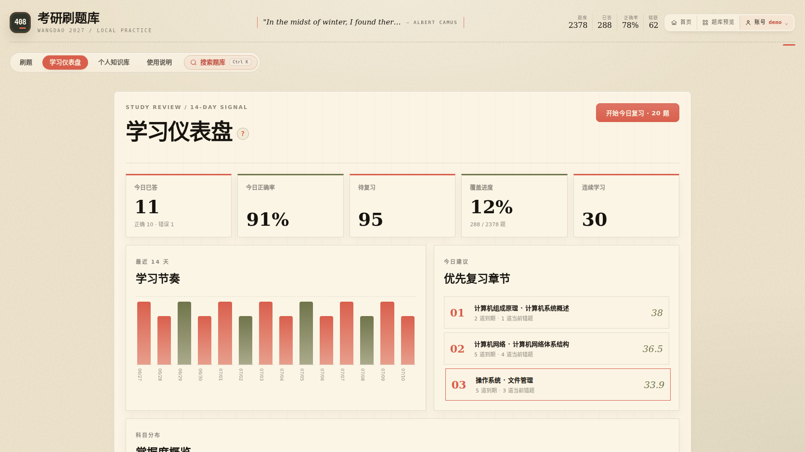
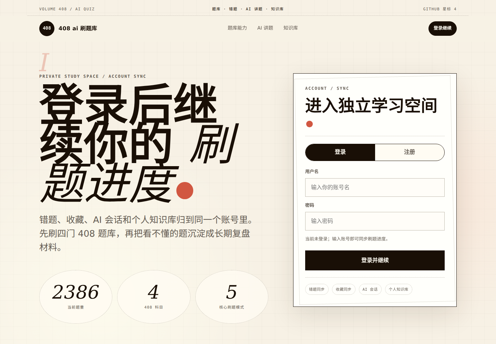
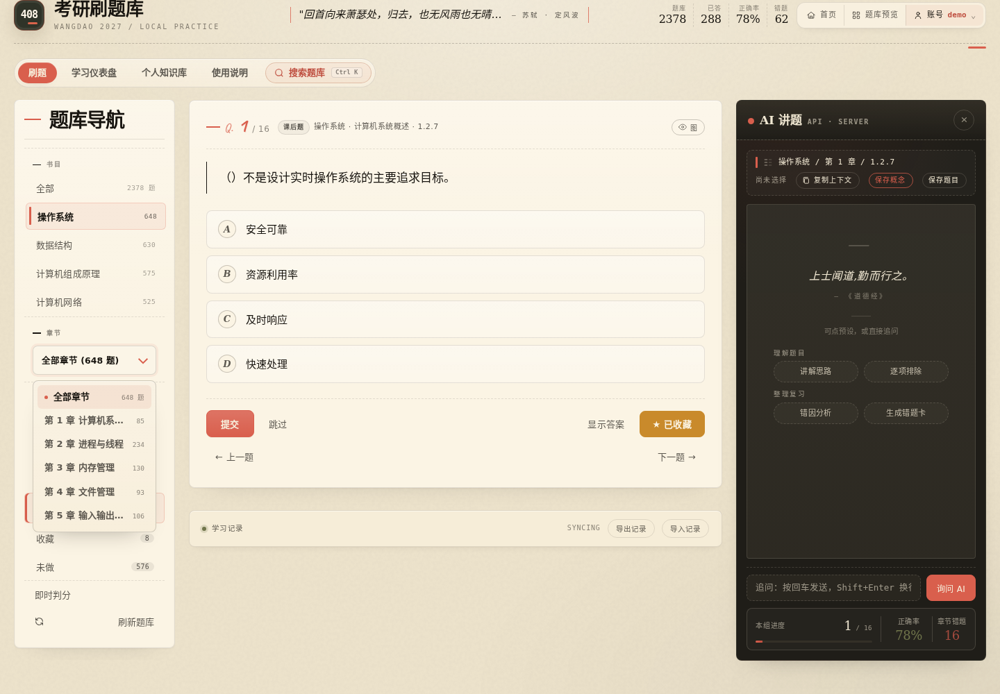
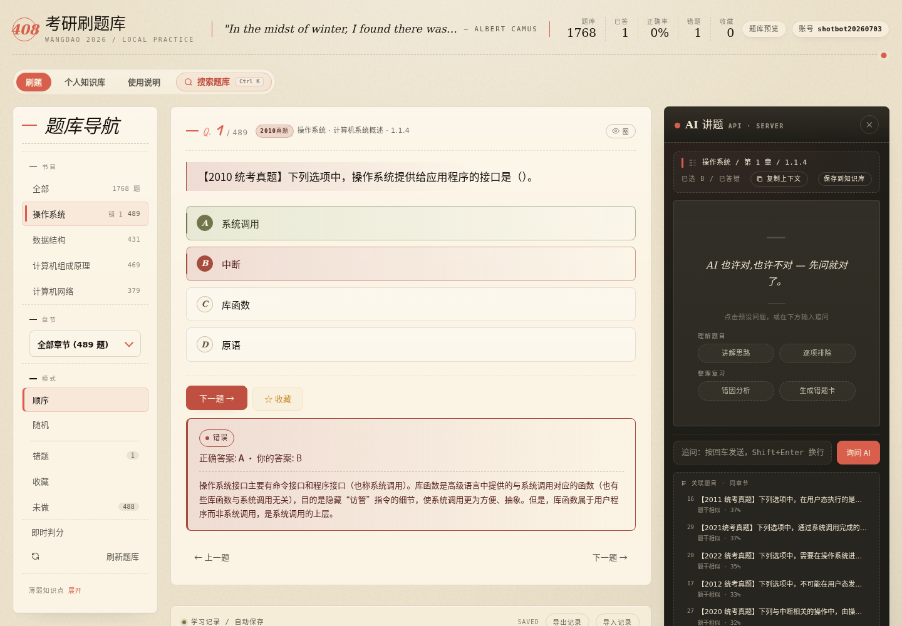
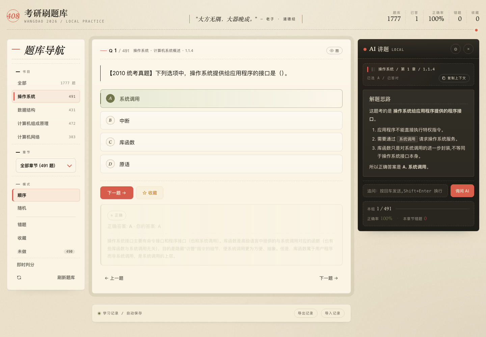

# 408 考研刷题库



一个无需前端构建即可运行的 408 网页题库，覆盖刷题、全文搜索、学习统计、间隔复习、AI 讲题和 Markdown 个人知识库。

- **静态部署：** 直接使用题库、搜索、错题、收藏、仪表盘、间隔复习和 JSON 备份，数据保存在当前浏览器。
- **完整后端：** 增加账号同步、修改密码、服务器 AI 和按账号隔离的个人知识库。

## 在线体验

- [首页](https://quiz.hermesjj.com/)
- [刷题](https://quiz.hermesjj.com/#/quiz)
- [学习仪表盘](https://quiz.hermesjj.com/#/dashboard)
- [个人知识库](https://quiz.hermesjj.com/#/wiki)
- [使用说明](https://quiz.hermesjj.com/#/guide)

页面未更新时，可使用 `Ctrl + F5`（Windows/Linux）或 `Cmd + Shift + R`（macOS）强制刷新。

## 主要功能

| 模块 | 能力 |
|---|---|
| 题库 | 操作系统、数据结构、计算机组成原理、计算机网络；当前前端过滤隐藏题后展示 2378 题 |
| 刷题 | 顺序、随机、今日复习、错题、收藏、未做和跨科目随机；支持单选、多选、即时判分和题目解析 |
| 搜索 | 搜索题干、选项和解析；按真题、模拟题、课后题及年份筛选；支持 `Ctrl/Cmd + K` |
| 学习仪表盘 | 按科目和章节展示完成度、正确率、错题、待复习量和近期变化，并推荐优先复习章节 |
| 间隔复习 | 答错后进入计划；答对后按 1、3、7、14、30、60 天延长间隔；连续答对后移出普通错题列表 |
| AI 讲题 | 复制当前题目上下文，或在完整后端模式下流式追问；可分别保存概念笔记或题目笔记 |
| 个人知识库 | 搜索、分类、预览、编辑、继续追问和软删除 Markdown 笔记 |
| 数据 | 浏览器本地保存；完整后端支持账号同步；学习记录可导入、导出 JSON |



## 5 分钟启动

需要 Python 3 或 Node.js，任选一种方式启动 HTTP 静态服务器。

```bash
git clone https://github.com/lij768423-svg/408-.git
cd 408-
python3 -m http.server 8767
```

或：

```bash
npx serve . -l 8767
```

打开 `http://127.0.0.1:8767/`。普通静态服务器没有 `/api/*`，应用会自动进入 `LOCAL` 模式，无需登录即可刷题。

> 不建议直接双击 `index.html`。应用需要通过 HTTP 读取 `data.json`，浏览器可能阻止 `file://` 页面访问本地资源。

## 运行模式

| 能力 | `LOCAL` 静态模式 | 完整后端模式 |
|---|---:|---:|
| 刷题、搜索、解析 | ✅ | ✅ |
| 错题、收藏、仪表盘、间隔复习 | 当前浏览器 | 账号同步并保留本地缓存 |
| JSON 导入与导出 | ✅ | ✅ |
| 复制题目上下文 | ✅ | ✅ |
| 页面内 AI 追问 | — | ✅ |
| 登录、修改密码、跨设备同步 | — | ✅ |
| 个人知识库 | — | ✅ |

完整后端需要实现仓库约定的认证、进度、AI 和知识库接口，详见 [`docs/BACKEND_API.md`](docs/BACKEND_API.md)。

## 新用户流程

1. 进入“刷题”，选择科目、章节和顺序或随机模式。
2. 选择答案并提交；多选题可连续选择多个选项。
3. 提交后查看正确答案、你的答案和题库解析。
4. 打开“学习仪表盘”，处理今日到期题目和优先章节。
5. 看不懂时复制上下文给外部 AI；完整后端也可直接在右侧追问。
6. 需要长期保留时，明确选择“保存概念”或“保存题目”。
7. `LOCAL` 用户建议定期导出学习记录，避免浏览器数据被清理后丢失。

应用内“使用说明”提供完整操作手册，这里不重复展开每个按钮。





## 数据与复习规则

浏览器状态保存在 `localStorage`，主要包括：

- 已答记录、正确数、错题、收藏和当前题单位置；
- 间隔复习计划、每日活动和部分界面偏好；
- 登录状态下从服务器读取并回写的学习进度缓存。

间隔复习规则：

- 答错后当天进入复习计划；再次答错会清空连续正确并立即到期。
- 答对后按 `1 → 3 → 7 → 14 → 30 → 60` 天延长间隔。
- 连续答对 2 次后移出普通错题列表，但仍保留长期复习计划。
- “今日复习”默认最多生成 20 道当前范围内的到期题。

## AI 与个人知识库

AI 面板会自动整理当前题目的科目、章节、题干、选项、用户选择、正确答案和解析。

- `LOCAL` 模式可复制 Markdown 上下文到任意外部 AI。
- 完整后端模式通过同源 `POST /api/ai/chat` 流式回答，生成中再次点击按钮可停止。
- “保存概念”只保存概念问题和 AI 回答，不发送题干、选项、答案或作答字段。
- “保存题目”保存当前题目的完整复盘信息。
- 知识库按账号隔离，笔记为 Markdown；删除操作移动到 `.trash`，不是立即永久删除。



## 开发与验证

项目使用原生 HTML、CSS 和经典脚本，无打包步骤。脚本加载顺序见 [`assets/js/README.md`](assets/js/README.md)。

```bash
npm install
npm test
npm run test:e2e
```

- `npm test`：JavaScript 语法、题库 JSON、学习调度算法和静态模式检查。
- `npm run test:e2e`：刷题、错题、收藏、复习、搜索、导入导出、仪表盘、登录、改密、同步、AI 和知识库关键流程。

题库变更后至少运行 `npm test`；界面或后端交互变更建议同时运行 E2E。

## 项目结构

```text
.
├── index.html                 # 页面结构、导航与应用内使用说明
├── data.json                  # 题库数据
├── assets/
│   ├── app.css                # 全局样式与响应式布局
│   ├── auth/login-intro.html  # 登录首页
│   └── js/                    # 状态、学习算法、仪表盘、刷题、认证、AI、知识库和搜索
├── docs/
│   ├── DEPLOYMENT.md          # 静态服务器、反向代理与容器部署
│   ├── BACKEND_API.md         # 完整后端接口契约
│   └── screenshots/           # README 截图
├── images/                    # 题图资源
├── scripts/                   # 数据与静态检查脚本
└── tests/e2e/                 # 关键流程 E2E
```

## 部署

- 静态部署、缓存策略、Nginx、Caddy 和 Docker 示例：[`docs/DEPLOYMENT.md`](docs/DEPLOYMENT.md)
- 认证 Cookie、进度同步、AI 流式响应和知识库接口：[`docs/BACKEND_API.md`](docs/BACKEND_API.md)

仓库当前提供前端与接口契约，不包含生产环境完整后端实现。只部署本仓库时应预期进入 `LOCAL` 模式。

## 浏览器与资源

推荐最新版 Chrome、Edge、Firefox 或 Safari。应用依赖 ES6、`fetch`、`localStorage` 和现代 CSS。

KaTeX 资源来自 CDN；离线或 CDN 不可用时公式会回退为原始文本，基础刷题仍可使用。

## 常见问题

- **为什么显示 `LOCAL`？** 页面未检测到完整后端或当前未登录。基础功能正常，数据保存在浏览器。
- **为什么 GitHub Pages 不能登录或使用 AI？** GitHub Pages 只托管静态文件，无法提供 `/api/*`。
- **换浏览器后进度没了？** `LOCAL` 数据不会跨浏览器同步，请在旧浏览器导出记录后导入。
- **线上仍是旧页面？** 强制刷新，并确认 `index.html`、脚本和样式没有被代理长期缓存。
- **AI 回答可靠吗？** AI 可能出错，最终答案应以题库解析、教材和考纲口径为准。

## 数据与许可

`data.json` 包含题目 ID、科目、章节、题型、题干、选项、答案、解析和来源信息。题图应使用仓库内相对路径，例如 `images/example.jpg`。

请勿提交包含隐私信息、密钥或未经授权的版权内容。

本项目基于 ISC License，详见 [`LICENSE`](LICENSE)。
