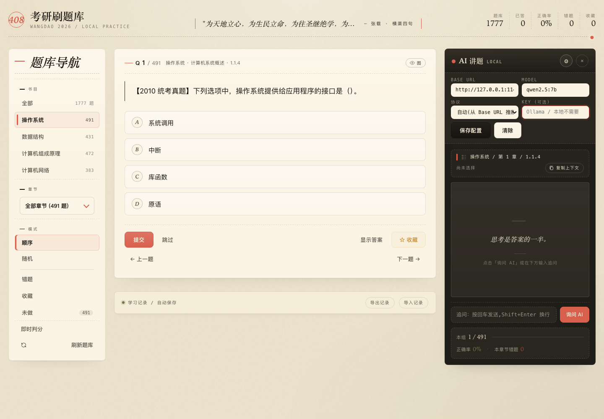

# 408 考研刷题库

一个轻量级、本地优先的 408 网页刷题应用，题库来自王道 2026/2027 四本 408 教材精选题。项目目标很简单：打开浏览器就能刷题，记录自动保存，错题和收藏长期可用，必要时还能把当前题目上下文交给 AI 讲解。

## 项目简介

408 考研复习很容易遇到两个问题：题量大，错题复盘容易散；资料多，但日常刷题工具又常常太重、太依赖账号或网络。这个项目把题库、刷题逻辑、错题记录和 AI 讲题整合在一个单页应用里。

核心特性：

- 本地运行：`index.html` + `data.json`，不需要后端服务。
- 四本书覆盖：操作系统、数据结构、计算机组成原理、计算机网络。
- 多种刷题模式：顺序、随机、错题、收藏、未做、全部随机。
- 自动保存进度：错题、收藏、已答、正确率、偏好设置都存在浏览器 `localStorage`。
- 支持 AI 讲题：可配置 OpenAI 兼容接口、Anthropic 兼容接口、Ollama 或本地 API。
- 支持公式和代码：KaTeX 公式渲染，题面/解析/AI 输出支持 Markdown 和代码块。
- 可导入导出记录：用 JSON 文件迁移学习记录。

## 界面预览

主界面采用三栏布局：左侧是书目、章节和模式导航；中间是题卡；右侧是 AI 讲题栏和本组学习概览。


答题后会显示选项状态、正确答案和解析。答错会自动加入错题本，答对错题会自动移出错题本。


章节和题量选择都使用自定义纸面下拉，不依赖系统原生菜单，视觉上和刷题界面保持一致。


全部模式下可以跨书随机刷题，并选择每组 20 / 50 / 100 / 200 题。


## 题库规模

当前 `data.json` 共包含 **1777** 道选择题：

| 科目 | 题量 | 章节数 |
|---|---:|---:|
| 操作系统 | 491 | 5 |
| 数据结构 | 431 | 8 |
| 计算机组成原理 | 472 | 7 |
| 计算机网络 | 383 | 6 |

题型分布：

| 类型 | 数量 |
|---|---:|
| 单选题 | 1740 |
| 多选题 | 37 |

每道题包含题干、4 个选项、答案和解析。

## 下载和安装

这个项目没有传统意义上的“安装”。下载到本地后，用浏览器打开即可。

### 方式一：直接下载 ZIP

1. 在 GitHub 页面点击 `Code`。
2. 选择 `Download ZIP`。
3. 解压到任意目录，例如：

```bash
~/408-quiz
```

4. 用下面任意一种方式打开。

### 方式二：使用 Git 克隆

```bash
git clone git@github.com:lij768423-svg/408-.git ~/408-quiz
cd ~/408-quiz
```

如果你只是刷题，不需要运行 `npm install`。仓库里的 `package.json` 主要用于开发时跑 Playwright 检查界面。

## 启动方式

### 推荐：本地 HTTP 服务

推荐固定用本地服务器打开，这样浏览器来源稳定，学习记录不会分裂。

```bash
cd ~/408-quiz
python3 -m http.server 8767
```

然后访问：

[http://127.0.0.1:8767/](http://127.0.0.1:8767/)

### 简单方式：直接打开 HTML

macOS 可以直接：

```bash
open ~/408-quiz/index.html
```

也可以双击 `index.html`。

注意：`file://` 和 `http://127.0.0.1:8767` 在浏览器里是两个不同来源，`localStorage` 不互通。建议长期固定使用同一种打开方式。

## 如何使用

### 1. 选择科目

左侧“书目”区域可以选择：

- 全部
- 操作系统
- 数据结构
- 计算机组成原理
- 计算机网络

选择“全部”时，会进入跨书随机刷题；选择单本书时，可以继续选择章节。

### 2. 选择章节

“章节”下拉支持：

- 全部章节
- 指定章节

章节切换后，题目列表会重新生成，当前进度回到本组第 1 题。


### 3. 选择刷题模式

单本书模式下支持：

| 模式 | 说明 |
|---|---|
| 顺序 | 按题库顺序刷 |
| 随机 | 当前范围内随机打乱 |
| 错题 | 只刷当前范围内做错过的题 |
| 收藏 | 只刷收藏题 |
| 未做 | 只刷还没有答过的题 |

全部模式下支持跨书随机，并可以选择每组题量：

- 每刷 20 题
- 每刷 50 题
- 每刷 100 题
- 每刷 200 题


### 4. 答题和判分

默认流程：

1. 点击 A/B/C/D 选择答案。
2. 点击“提交”判分。
3. 查看正确答案和解析。
4. 点击“下一题”继续。

即时判分开启后：

- 单选题：点击选项后立即判定。
- 多选题：选错会立即判错；选全正确答案后判对。

答错的题会自动进入错题本；错题再次答对后，会自动从错题本移除。


### 5. 收藏和复盘

点击“收藏”可以把当前题加入收藏夹。收藏不会因为答对、刷新题库而消失，适合保存：

- 容易混淆的概念题
- 计算过程复杂的题
- 真题或高频题
- 需要二刷三刷的题

### 6. 导出和导入学习记录

底部“学习记录 / 自动保存”区域提供：

- 导出记录
- 导入记录

导出的 JSON 包含错题、收藏、答题统计、当前会话和偏好设置。换电脑或换浏览器时，可以先导出，再在新环境导入。

## 键盘快捷键

| 键 | 作用 |
|---|---|
| `A` / `B` / `C` / `D` | 选择对应选项，多选题可累积选择 |
| `Enter` | 提交或进入下一题 |
| `←` / `→` | 上一题 / 下一题 |
| `Space` | 显示答案 |
| `F` | 收藏 / 取消收藏 |

## AI 讲题

右侧 AI 栏会随当前题自动更新上下文。它可以当作两种工具使用：

- **复制上下文**：不配置 API 也能用，把当前题完整上下文复制出来，粘贴到任意 AI 工具。
- **内置讲题**：配置 API 后，直接在页面右侧追问并获得 Markdown + 公式渲染后的讲解。



### AI 上下文包含什么

每次切题时，AI 栏都会自动整理当前题信息，包括：

- 题源
- 章节
- 题型
- 当前选择
- 正确答案
- 题干
- 选项
- 解析

所以你追问时不用再手动复制题干，直接问“为什么选 A”“B 为什么不对”“这题考点是什么”即可。

### 如何配置 AI API

点击 AI 栏右上角的齿轮按钮，可以打开配置面板。

| 字段 | 说明 |
|---|---|
| Base URL | API 服务地址，例如 OpenAI 兼容接口、Ollama、本地中转服务 |
| Model | 模型名称，例如 `qwen2.5:7b`、`deepseek-chat`、`gpt-4o-mini` |
| 协议 | 可选自动推断、OpenAI 兼容、Anthropic 兼容 |
| Key | API Key；Ollama 或本地服务通常可以留空 |

配置完成后点击“保存配置”。保存后右上角会从 `LOCAL` 变成 `API · 模型名`。

#### Ollama / 本地模型示例

如果你本地启动了 Ollama，并开启 OpenAI 兼容接口，可以这样填：

| 字段 | 示例 |
|---|---|
| Base URL | `http://127.0.0.1:11434/v1` |
| Model | `qwen2.5:7b` |
| 协议 | OpenAI 兼容 |
| Key | 留空 |

#### OpenAI 兼容接口示例

如果你使用 DeepSeek、OpenAI 或其他兼容 `/chat/completions` 的服务：

| 字段 | 示例 |
|---|---|
| Base URL | `https://api.deepseek.com` |
| Model | `deepseek-chat` |
| 协议 | OpenAI 兼容 |
| Key | 填自己的 API Key |

#### Anthropic 兼容接口示例

如果使用 Anthropic 兼容接口：

| 字段 | 示例 |
|---|---|
| Base URL | `https://api.anthropic.com` |
| Model | `claude-3-5-sonnet-latest` |
| 协议 | Anthropic 兼容 |
| Key | 填自己的 API Key |

API Key 只保存在当前浏览器的 `localStorage`，不会写入导出的学习记录 JSON。

### 如何使用 AI 讲题

常见流程：

1. 先正常答题或点击“显示答案”。
2. 在右侧输入框输入追问，例如“讲一下这题为什么选 A”。
3. 点击“询问 AI”。
4. 查看右侧输出，继续追问细节。

你也可以点击“复制上下文”，把当前题目、选项、答案、解析一次性复制出去。


### 未配置 API 时会怎样

如果没有配置 API：

- “复制上下文”正常可用。
- 在输入框追问并点击“询问 AI”时，会把追问上下文复制到剪贴板。
- 页面不会把题目发送到任何外部服务。

如果配置了 API 但请求失败，AI 栏会显示错误提示，并回退展示本地整理的题目上下文，方便你继续复制到其他工具。

### 支持的 API 类型

配置区域支持：

- OpenAI 兼容接口：`/chat/completions`
- Anthropic 兼容接口：`/v1/messages`
- Ollama 或本地 OpenAI 兼容服务
- 其他兼容 Chat Completions 的中转服务

## 公式、代码和题图

题面、解析和 AI 输出支持：

- Markdown 段落、列表、引用、代码块
- KaTeX 公式
- 行内公式：`\(...\)` 或 `$...$`
- 块级公式：`\[...\]` 或 `$$...$$`
- 题图引用：`images/...`
- 表格内容

代码块会做轻量排版和语法高亮，适合展示 C 语言片段、伪代码、汇编片段和算法流程。

## 数据从哪里来

项目根目录的 `data.json` 是刷题数据文件。它由 Obsidian vault 内的提取脚本生成，不需要应用运行时联网下载。

数据生成流程大致是：

1. 从 vault 中读取四本书的章节 Markdown。
2. 找到每章的“本节习题精选”和“答案与解析”。
3. 提取 4 选项题。
4. 配对题干、选项、答案和解析。
5. 输出标准化 JSON 到本项目目录。

当前使用的生成命令：

```bash
cd ~/Documents/文稿 - dajiji的MacBook Air/Obsidian Vault
python3 wiki/tools/_extract_questions.py
```

脚本会读取类似路径：

```text
wiki/sources/操作系统/chapters/ch*.md
wiki/sources/数据结构/chapters/ch*.md
wiki/sources/计算机组成原理/chapters/ch*.md
wiki/sources/计算机网络/chapters/ch*.md
```

并输出：

```text
~/408-quiz/data.json
```

### data.json 结构

数据大致结构如下：

```json
{
  "questions": [
    {
      "id": "os-1-001",
      "book": "操作系统",
      "chapter": 1,
      "chapter_title": "计算机系统概述",
      "section": "1.1.4",
      "type": "single_choice",
      "question": "题干...",
      "options": {
        "A": "选项 A",
        "B": "选项 B",
        "C": "选项 C",
        "D": "选项 D"
      },
      "answer": ["A"],
      "explanation": "解析..."
    }
  ]
}
```

只要保持这个结构，也可以替换成自己的题库。

## 文件结构

```text
408-quiz/
├── index.html          # 单页应用，内嵌 CSS 和 JS
├── data.json           # 题库数据
├── docs/
│   └── screenshots/    # README 演示截图
├── images/             # 题图资源
├── README.md           # 项目说明
├── package.json        # 开发辅助依赖
└── package-lock.json
```

## 开发说明

核心应用是单文件结构，没有构建步骤：

- 样式：写在 `index.html` 的 `<style>` 中。
- 逻辑：写在 `index.html` 的 `<script>` 中。
- 数据：运行时 `fetch("data.json")` 加载。
- 状态：使用 `localStorage` 持久化。

开发时可以启动本地服务：

```bash
python3 -m http.server 8767
```

如果需要用 Playwright 做界面检查，可以安装依赖：

```bash
npm install
```

## 设计特色

这个应用不是后台管理系统，也不是花哨的刷题平台。设计方向是“纸面题册 + 批注栏”：

- 米色纸面背景，长时间刷题不刺眼。
- 珊瑚色用于选中、强调和操作反馈。
- 左侧是目录式导航，中间是题卡，右侧是 AI 批注栏。
- 选项、反馈和下拉菜单都尽量像纸面批注，而不是系统控件。
- AI 栏使用深色，和题卡形成“白天刷题 / 夜间讲解”的层次差。

## 未来计划

后续可以继续开发这些方向：

- 全文搜索：按题干、选项、解析搜索。
- 真题标签：按年份、统考真题、模拟题等标签筛选。
- 统计面板：按科目、章节、题型展示正确率和薄弱点。
- 答题计时：记录每题耗时和平均速度。
- 复习计划：按错题间隔重复提醒。
- 更细的错因分类：概念不清、计算错误、审题错误、记忆混淆等。
- 多端同步：把 localStorage 数据同步到云端或 Git 仓库。
- PWA 离线安装：支持像桌面应用一样安装到系统。
- 数据生成工具开源化：把提取脚本整理成独立命令，方便替换题源。
- 综合题支持：支持非 A/B/C/D 的大题、简答题和计算题。

## 常见问题

### 为什么我的记录不见了？

通常是打开方式变了。`file://`、`http://127.0.0.1:8767`、不同浏览器、不同域名端口都有各自独立的 `localStorage`。

建议固定使用：

```text
http://127.0.0.1:8767/
```

### 能不能离线使用？

核心刷题功能可以离线使用，因为题库在本地 `data.json`。但 KaTeX 的 CDN 文件和外部 AI API 需要网络。若需要完全离线，可以把 KaTeX 资源下载到本地并修改引用路径。

### 会不会上传我的学习记录？

不会。学习记录默认只保存在浏览器本地。只有你主动配置并调用外部 AI API 时，当前题目的上下文才会发送到对应 API。

### 能不能换成自己的题库？

可以。保持 `data.json` 的结构一致即可。题目需要至少包含 `question`、`options`、`answer` 和 `explanation` 等字段。

## 浏览器兼容

建议使用现代浏览器：

- Chrome 121+
- Edge 121+
- Safari 14+
- Firefox 88+

需要支持 ES6、`fetch`、`localStorage` 和现代 CSS。
