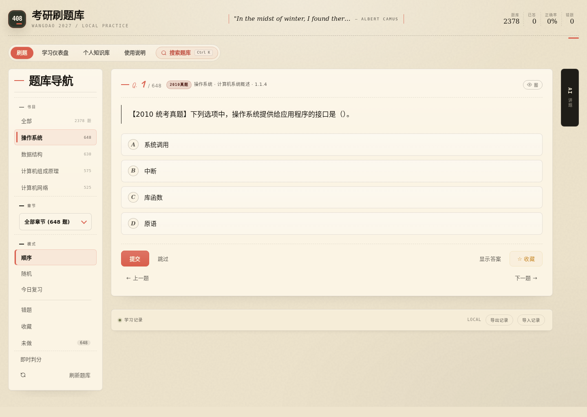
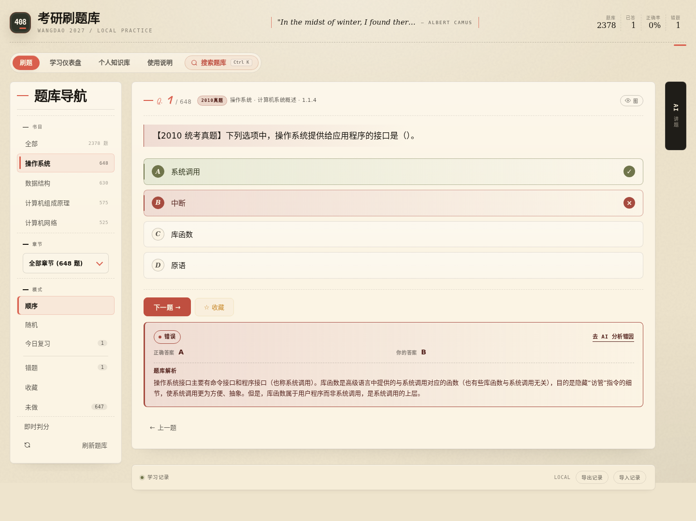
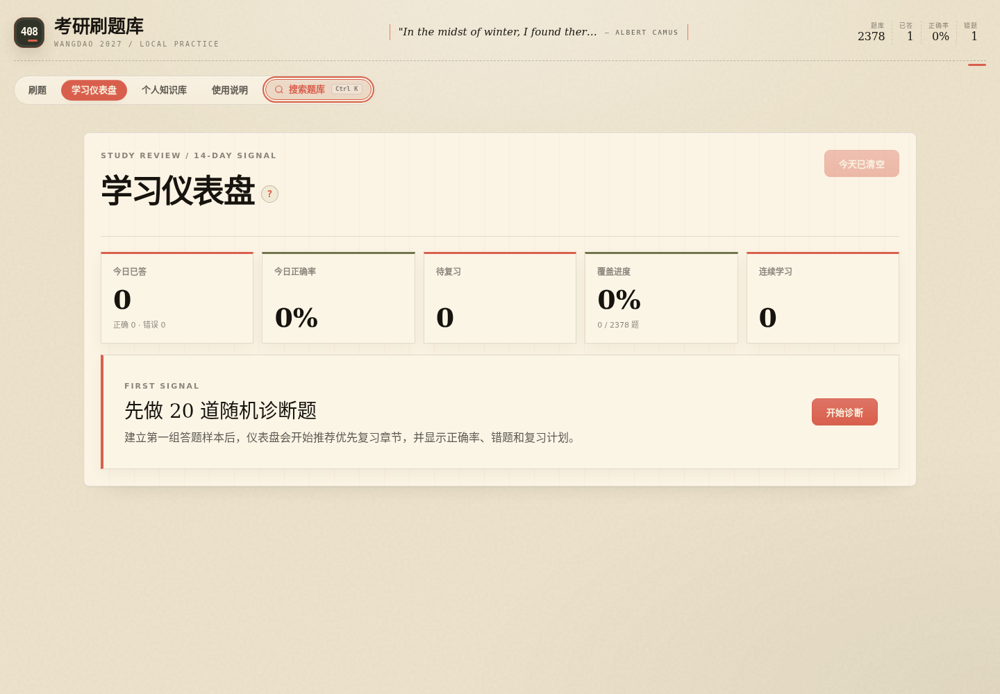
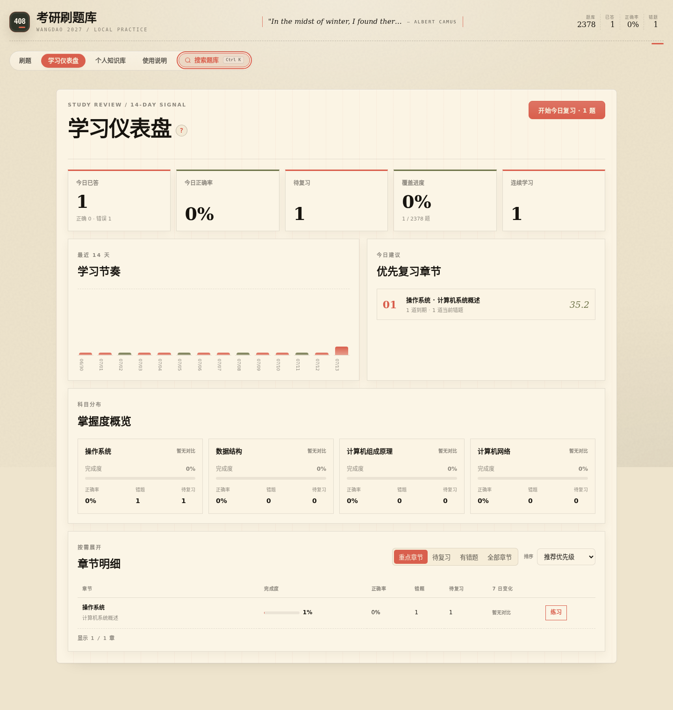

# 桌面端使用手册

本文说明 408 考研刷题库的桌面端使用方式，适用于在线站点和本地静态部署。当前界面以宽度不低于 `1280px` 的桌面浏览器为主要环境，不覆盖移动端布局。

- 在线站点：<https://quiz.hermesjj.com/>
- 应用内说明：<https://quiz.hermesjj.com/#/guide>
- 项目启动与开发：见 [`../README.md`](../README.md)

## 1. 先确认运行模式

页面底部会显示当前数据状态：

| 状态 | 含义 |
|---|---|
| `LOCAL` | 未登录或没有完整后端；学习记录保存在当前浏览器 |
| `NEW` | 已登录，但服务器还没有该账号的学习记录 |
| `SYNCING` | 正在把最新记录同步到服务器 |
| `SAVED` | 最近一次学习记录已同步 |
| `SYNC FAIL` | 同步暂时失败，本地记录仍保留，可继续刷题 |

`LOCAL` 模式可以使用刷题、搜索、错题、收藏、仪表盘、间隔复习和 JSON 备份。页面内 AI、账号同步、题库预览和个人知识库需要登录并连接完整后端。

## 2. 第一次使用

有两种开始方式：

### 方式 A：先做随机诊断

1. 打开“学习仪表盘”。
2. 在首次引导中点击“开始诊断”。
3. 完成系统生成的 20 道随机题。
4. 返回仪表盘查看优先复习章节、正确率、错题和待复习计划。

这种方式适合第一次使用，不确定应该从哪一科、哪一章开始的用户。

### 方式 B：直接按章节学习

1. 打开“刷题”。
2. 在左侧选择科目和章节。
3. 选择顺序、随机或其他题单模式。
4. 设置题量并开始作答。

建议第一轮使用“顺序”，每章先做 10 至 20 题；复盘时再使用“随机”“错题”“今日复习”。

## 3. 刷题操作

### 题单范围

| 模式 | 适用场景 |
|---|---|
| 顺序 | 初次学习，按题库顺序推进 |
| 随机 | 检查是否真正掌握，减少位置记忆 |
| 今日复习 | 只做当前范围内已经到期的复习题，默认最多 20 题 |
| 错题 | 处理当前仍未做对的题目 |
| 收藏 | 集中练习主动收藏的典型题、易混题 |
| 未做 | 补齐当前范围内尚未作答的题目 |
| 全部 | 跨科目随机生成题单 |

章节菜单支持键盘操作：聚焦章节选择器后，使用 `↑`、`↓` 移动，按 `Enter` 选择，按 `Esc` 关闭。菜单会限制在可视区域内滚动，关闭后焦点回到触发按钮。

### 选择与提交

- 每个选项都是原生按钮，可用 `Tab` 聚焦，按 `Enter` 或空格选择。
- 单选题一次选择一个选项；多选题可连续选择多个选项。
- 开启“即时判分”后，单选会在选择后直接判断；多选选错时立即判错，选齐正确项时判对。
- 未开启即时判分时，选择完成后点击“提交”。
- “显示答案”不会把当前选择计入正式正确率，结果区会标记为仅供参考。

### 查看反馈

提交后，选项右侧会用勾和叉标记正确项与错误选择。结果区集中展示：

- 本题是正确、错误还是仅查看答案；
- 正确答案；
- 你的答案；
- 题库解析；
- 唯一主要操作“下一题”；
- 答错时的“去 AI 分析错因”。

收藏不会改变作答结果，可在提交前后随时使用。题单首尾的“上一题”“下一题”只切换当前题单，不会删除学习记录。

## 4. 搜索题库

点击顶部“搜索题库”，或按 `Ctrl + K`（macOS 为 `Cmd + K`）打开全文搜索。

搜索范围包括题干、选项和解析。可以进一步筛选：

- 来源：全部、真题、模拟题、课后题；
- 年份：选择某个年份或全部年份。

键盘操作：

| 按键 | 操作 |
|---|---|
| `↑` / `↓` | 在搜索结果间移动 |
| `Enter` | 打开当前结果并跳转到题目 |
| `Tab` / `Shift + Tab` | 在输入框、筛选器、关闭按钮和结果区域间移动 |
| `Esc` | 关闭搜索并返回原来的操作位置 |

搜索弹窗会限制键盘焦点，关闭后恢复到打开搜索前的元素。

## 5. 学习仪表盘

仪表盘把作答数据转成下一步学习建议。没有任何答题记录时，会先显示 20 题随机诊断入口；完成第一组样本后才开始给出更有意义的优先章节。

### 主要指标

- 今日已答：当天的正式作答数量，以及正确、错误拆分；
- 今日正确率：当天正式作答的正确比例；
- 待复习：已经到期、建议今天完成的题目数；
- 覆盖进度：已经作答的题目占当前可见题库的比例；
- 连续学习：连续有正式作答记录的天数；
- 学习节奏：最近 14 天的答题量与正确情况；
- 优先复习章节：结合完成度、正确率、错题和到期题目计算的推荐章节。

### 章节明细

章节明细默认只展示优先级最高的 8 行。可以使用：

- 范围筛选：重点章节、待复习、有错题、全部章节；
- 排序：推荐优先级、完成度、正确率、待复习数；
- “查看全部”：展开当前筛选下的全部章节；
- “收起”：恢复为前 8 行；
- “练习”：直接以该章节生成题单。

### 间隔复习规则

1. 答错后，题目当天进入复习计划。
2. 答对后，复习间隔依次延长为 1、3、7、14、30、60 天。
3. 连续答对 2 次后，题目移出普通错题列表，但保留长期复习计划。
4. 之后再次答错，会清空连续正确并立即重新到期。

“今天已清空”表示当前没有到期题目，不代表学习数据丢失。仪表盘标题旁的 `?` 可以查看指标与收录规则。

## 6. AI 讲题

右侧 AI 面板默认收起，点击“AI 讲题”展开。展开或收起偏好保存在当前浏览器；登录后也会随学习偏好同步。

面板状态会区分本地能力和服务器能力：

- `LOCAL`：可以复制当前题目的 Markdown 上下文，粘贴到外部 AI；
- 服务器可用：可以直接流式追问，生成中再次点击按钮可停止；
- 服务器不可用：基础刷题不受影响，改用“复制上下文”。

AI 上下文包含当前题目的科目、章节、题干、选项、你的选择、正确答案和题库解析。可使用“讲解思路”“逐项排除”“错因分析”“生成错题卡”等预设，也可输入具体问题。

答错后点击结果区的“去 AI 分析错因”，系统会自动展开 AI，并带入你的选择与正确答案。提问应尽量具体，例如“为什么 B 不成立”“题干里的限定词是什么”。

### 保存到知识库

- 保存概念：只保存最近一次具体概念问题和 AI 回答，不发送题干、选项、答案或作答字段；
- 保存题目：保存当前题目的题干、选项、答案、解析、作答状态和 AI 讲解；
- 两种保存都需要登录；AI 回答不会自动写入知识库，必须由用户明确点击保存。

AI 可能出错，最终结论以题库解析、教材和考纲口径为准。

## 7. 题库预览

登录后可从账号菜单打开“题库预览”，按科目和章节查看题号状态：

- 做对；
- 错题；
- 收藏；
- 未做。

可以按错题、收藏或未做筛选。点击题号会跳到对应题目；仅打开预览不会修改学习记录。

## 8. 账号、同步与备份

登录后，作答、错题、收藏、复习计划、每日活动、当前题单和部分界面偏好会自动同步。修改密码成功后，当前设备保留登录，其他设备的会话会退出。

无论是否登录，都建议定期使用：

- 导出记录：下载包含学习状态的 JSON 备份；
- 导入记录：从之前导出的 JSON 恢复学习状态。

`LOCAL` 模式的数据只属于当前浏览器。换浏览器、清理站点数据或使用隐私窗口，都可能看不到原来的进度。

## 9. 个人知识库

个人知识库需要登录。笔记按账号隔离，保存为 Markdown。

- 左侧按科目浏览目录；
- 顶部可切换全部问题、概念问题和题目问题；
- 搜索匹配标题、路径、标签和正文；
- 笔记支持预览、编辑、基于当前内容继续追问；
- AI 回答需要确认后才能追加到笔记；
- 删除会把文件移动到 `.trash`，不是立即永久删除。

## 10. 常见问题

### 页面为什么显示 `LOCAL`？

当前未登录，或部署环境没有提供完整后端。基础刷题和本地学习记录正常可用。

### 为什么右侧没有 AI 内容？

AI 面板默认收起。点击页面右侧“AI 讲题”展开；如果状态为 `LOCAL`，请使用“复制上下文”。

### 为什么仪表盘只有“开始诊断”？

当前还没有正式作答样本。完成诊断或任意章节的几道题后，仪表盘会显示完整指标和优先章节。

### 为什么搜索结果数量变少？

检查是否启用了来源或年份筛选。搜索结果数是当前关键词和筛选条件共同作用后的数量。

### 为什么换浏览器后进度没有了？

`LOCAL` 数据不会跨浏览器同步。请在旧浏览器导出记录，再在新浏览器导入；登录模式则等待状态显示 `SAVED`。

### 同步失败会丢数据吗？

不会立即丢失。页面仍会保留本地记录，网络恢复后继续操作会再次触发同步。为稳妥起见，可以额外导出 JSON 备份。

### AI 回答可以直接当标准答案吗？

不建议。AI 用于解释、对比和整理错因，最终答案应以题库解析、教材和考纲为准。
